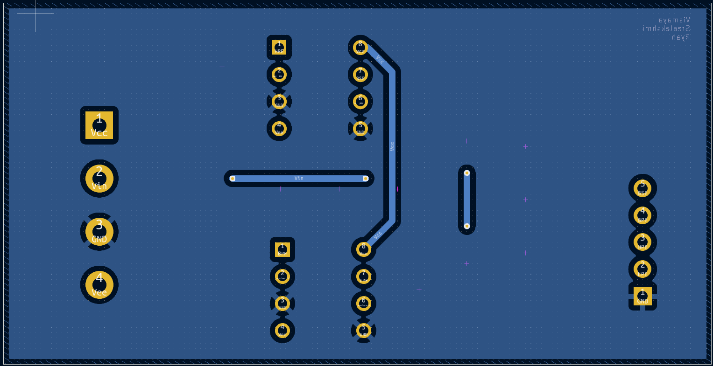

Hi it's post 1. Below is the detailed view of my project:

# PCB 2D layout

This is the 2D Ki-CAD Layout for the PCB Design

# Final Board Design

This is the final board PCB Design

You can get more info about the project [here](https://ryanromeodev.github.io/hsb-amcd-sose2025-5/#pcb-design-using-kicad)