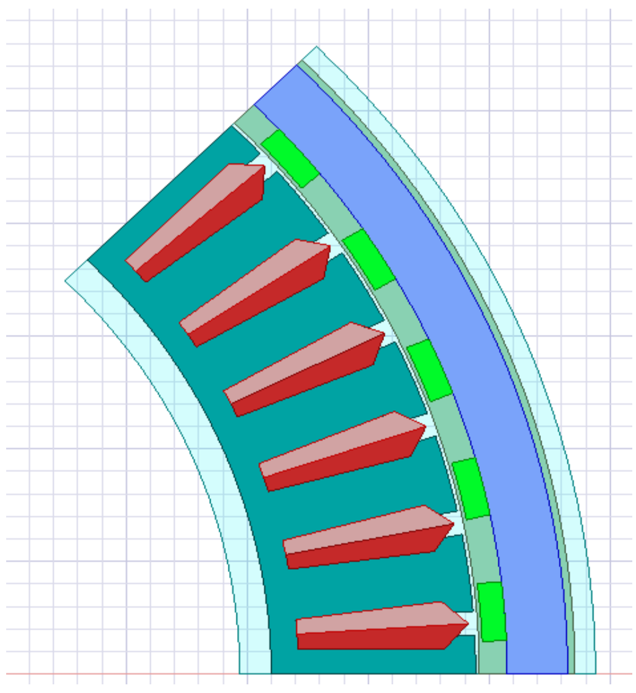
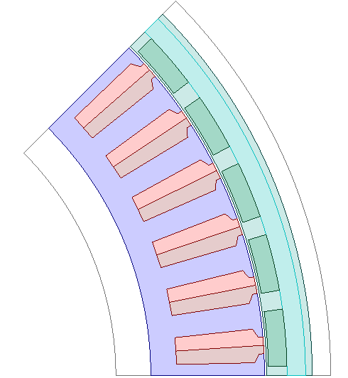
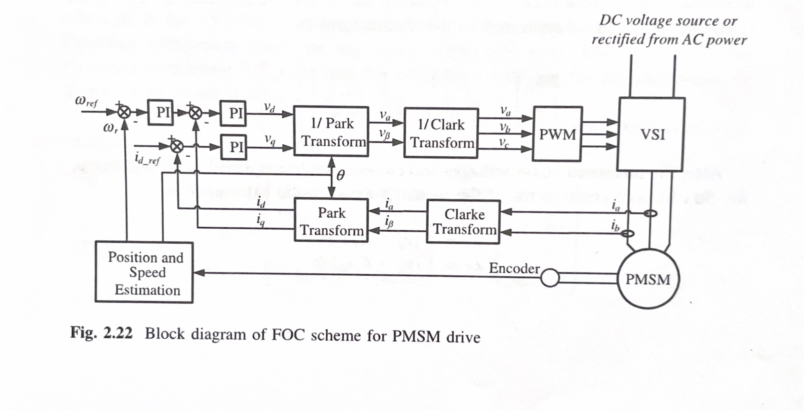
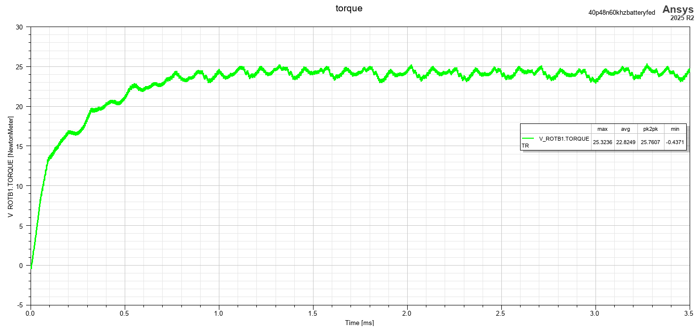
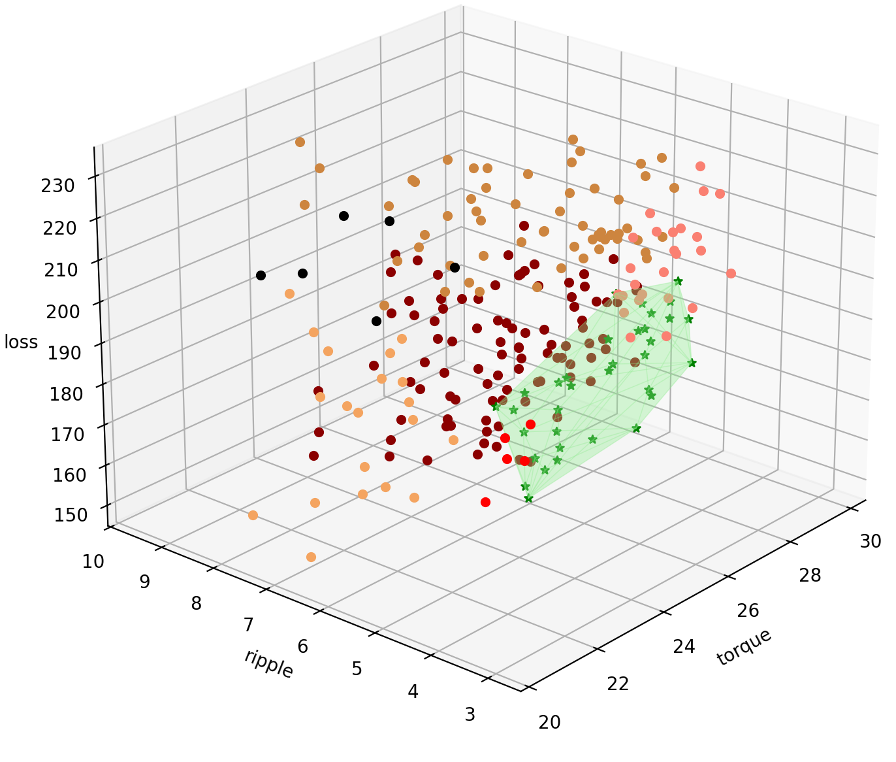

# Objective

Co-Optimisation of the Electric Drive for a UAV system is attempted with focus on inverter and motor parameters with the goal of reduction of optimisation time with the inverter focus on High frequency inverter. The. overall idea is to realise the problem definition via simulation and to check for the optimum sweet spot for each use case of the drone design. Manual search on the design space require heavy computational cost and would require years to converge and hence a ML approach with modelling and prediction. A single FEA Analysis takes 2 Hours to converge into the result for producing 2 electrical cycles for the motor. 

# Approach
This thesis introduces a novel system-level co-design methodology to resolve this issue. The
idea is to generate a comprehensive data basis by running a large number of simula+ons across a range
of motor geometries and inverter switching parameters. This dataset is then used to train a surrogate
machine learning regressor model that can predict the performance of electric drive systems. By
integra+ng this trained surrogate model into the op+miza+on loop, the proposed framework is intended
to drama+cally accelerate the process, allowing for the concurrent op+miza+on of motor geometry and
inverter switching parameters to maximize the overall performance of the UAV electric drive system.

# Initial Design
The initial cross section of the motor was as per the image below:

# Final Motor Design
The final design of the motor was updated with UPD stator to have even further fine tuned and generic control over the motor paramaeters

# FOC Control behavioural model
An FOC control of behavioural model was developed with integrated clarkes and parkes transform to make the drone operate near the minimal torque ripple region of operation. The block diagram of the FOC system which is taken from [1](https://doi.org/10.1007/978-3-662-49271-0){target="_blank"} is given below:

# Input parameters

The input parameters under consideration are:
* Bs1 : Slot wedge maximum width taken from [2](https://ansyshelp.ansys.com/public/Views/Secured/Electronics/v242/en/Subsystems/Maxwell/Content/SlotCoreUDP.htm){target="_blank"}
* Bs2 : Slot body bottom width (0 for parallel teeth) [2](https://ansyshelp.ansys.com/public/Views/Secured/Electronics/v242/en/Subsystems/Maxwell/Content/SlotCoreUDP.htm){target="_blank"}
* Height of the magnet
* Thickness of the magnet
* Inverter Switching Frequency of operation (High-frequencies)

Which was found by sensitivity analysis and pearson's correlation coefficient calculation.

# Output parameters

Torque, Torque Ripple and Losses are calculated. For the reference the Torque graphs is attached below:

The average of these values are selected for each design points and a Full factorial designs are made using python scripting using [PyAEDT](https://aedt.docs.pyansys.com/version/stable/){target="_blank"}.

# Data Visualisation

The 3D plot is made with the output parameters along each of the axis as follows in python:

# Further analysis

Machine Learning Surrogate model is to be made on the dataset and anlysed to have a concllusive results with cross verification of the optimum points with FEA analysis.
